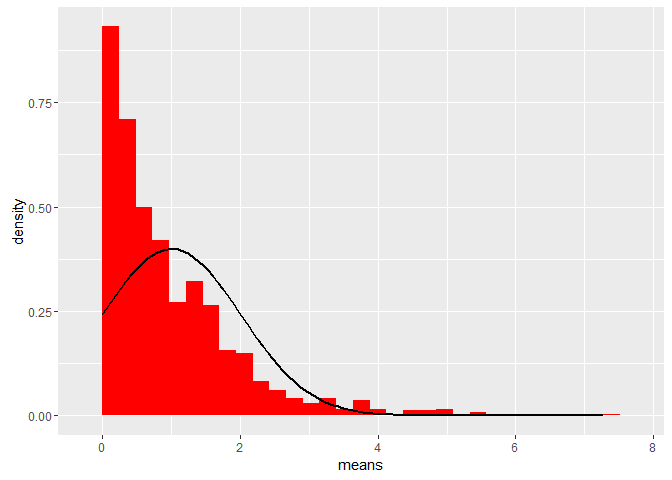

# Central Limit Theorem Simulator
David Karlsson  
19 januari 2016  

This document describes the usage of the Central Limit Theorem Simulator shiny app implemented as part in the course project for the Coursera course Developing Data Products. 

The app takes inspiration from the first part of the course project for the course Statistical Inference where the aim was to investigate how the Central Limit Theorem applies to the exponential distribution. According to the Central Limit Theorem, the distribution of sampling averages from any statistical distribution will be approximately normal given a sufficently large number of observations. 

In this Shiny app it is possible to test how rapid the convergence is for different distributions. Currently the app supports three distributions (Nomal distribution, Uniform distribution, and Exponential distribution).

## Usage
The basic input to the app contains of four variables: the random seed (to make all results from the app reproducible), the distribution (select from the supported distributions), the number of samples, and the number in each average (1 will just give a number of observations from the distribution, higher numbers will give averages of independent identically distributed observations from the distribution).

In addition to the basic inputs, each distribution also have some parameters that are also listed in the input panel. For the Normal distribution the inputs are the mean (mu) and the standard deviation (sigma). 

## Output
Once all inputs are in place, the app will make some calculations from the given inputs, this may take a couple of seconds in case of large number of samples/in each average. The results of the calculations are represented as a plot and a table.

The plot is a histogram plot of the averages with the theoretical Normal distribution (the normal distribution with mean and standard deviation according to the Central Limit Theorem) as a curve on top. An example plot (random seed 1337, Exponential distribution, 1000 samples, 1 observation in each average, and lambda=1) is shown below

\

The other output from the simulator is a table with the theoretical (according to the Central Limit Theorem) and actual (observed in the current sample) values for the mean and standard deviation. According to the Central Limit Theorem, the difference between theoretical and actual values should become smaller when the number of samples increase. 

